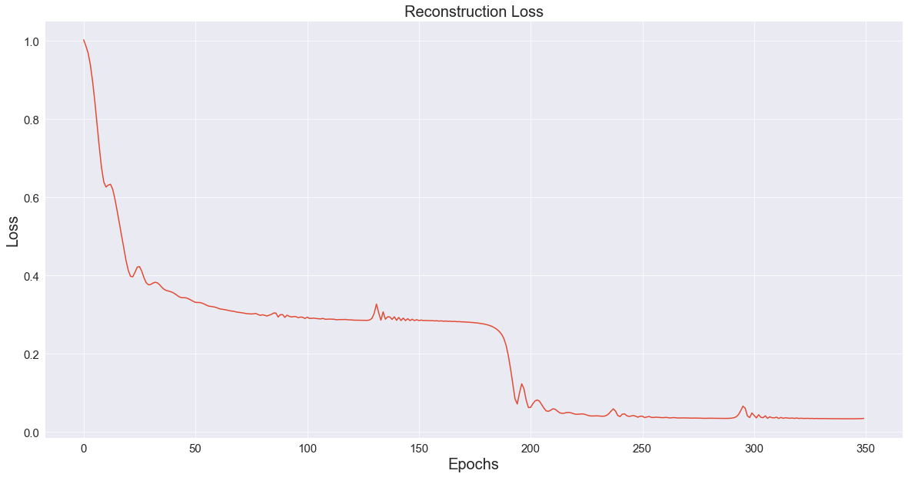

# Jet data Compression
This repository contains a Stacked Auto Encoder made in order to compress Hadron Jet Data from 4->3 Variables. Dataset provided by CERN.

## Approach
I have used a Stacked Autoencoder of 3D Latent Dimensions. This way the SAE is decompressing 4D data into 3D thus reducing the space it takes. 

Most of the complex topics are explained in the Notebook cells itself. More detailed documentation is under work, since I have mid-semester exams on the horizon and hence the documentation progress is slow (for now).

The Model currently performs "OK-ish" - judging from the final loss. The Reconstruction Loss (Mean Squared error measuring the distance between original data and the reconstructed data) after 350 epochs on training closes to about `0.03`.

My current work is insipired by the work previously done by [Eric Wulff](https://github.com/erwulff/lth_thesis_project), his [thesis](https://lup.lub.lu.se/student-papers/search/publication/9004751), and by [Skelpdar - HEP Autoencoders](https://github.com/Skelpdar/HEPAutoencoders) on the same.

## Remarks
Regardless of GSOC, I am planning to work on this project throughout my summer (I have found it interesting!). The current model isn't the best and there's a lot of room for improvement. 
As seen in other solutions to this problem, I can potentially add `Batch Norm` layers into the model along with `dropout`, which may improve performance, but will be add more complexity to the code since, a seperate subroutine will have to be implemented to get test predictions.

If you find any sort of error or improvement in my code / docs, please feel free to raise an issue and add a PR!